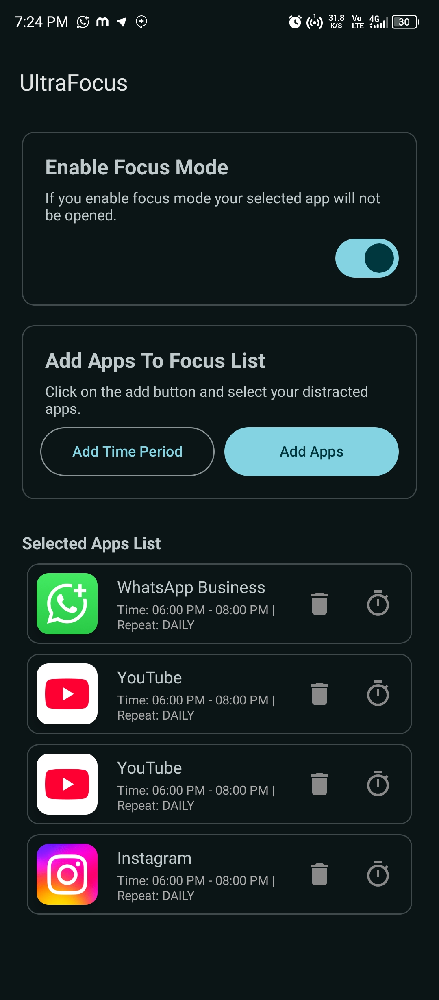
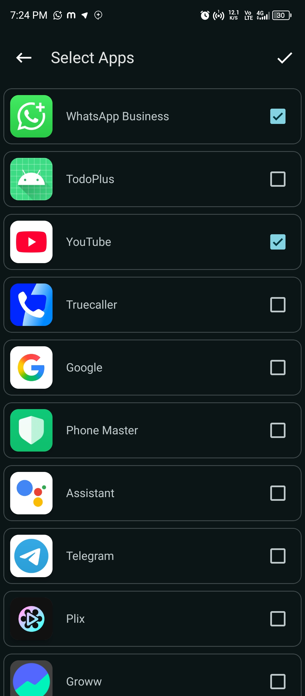
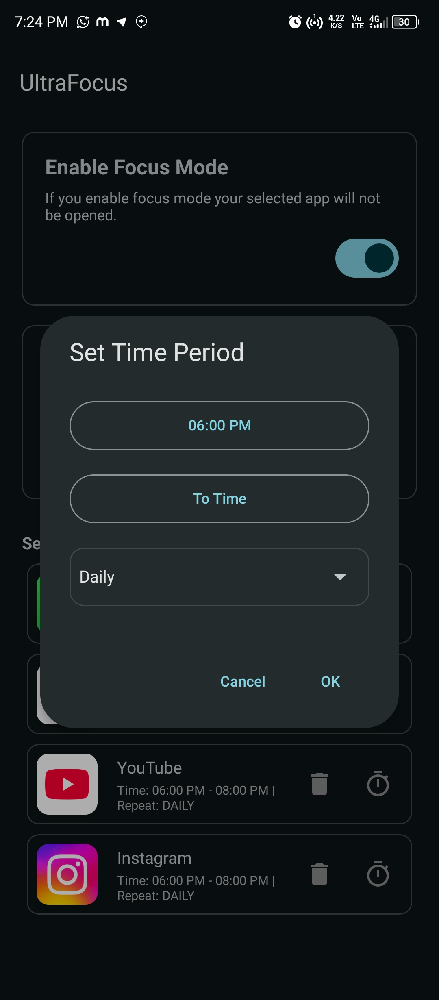
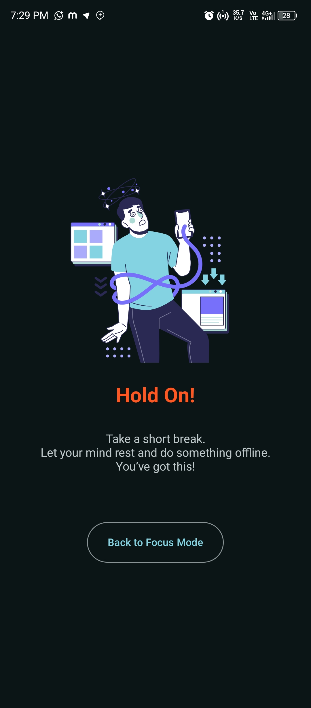
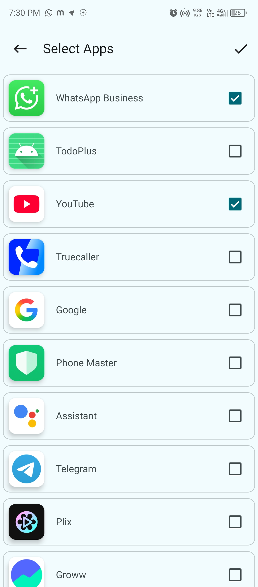
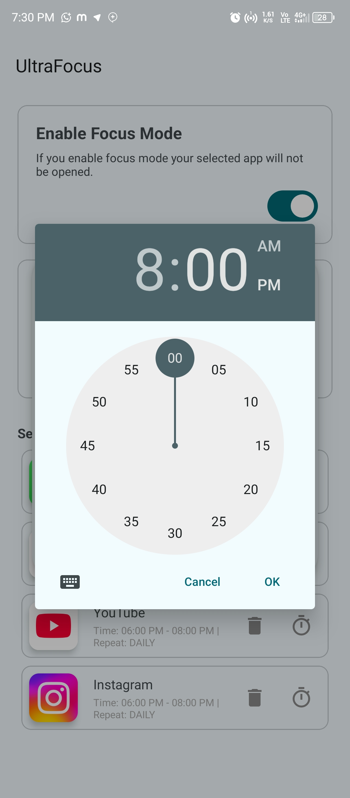
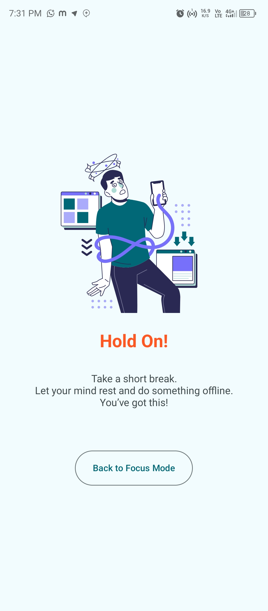
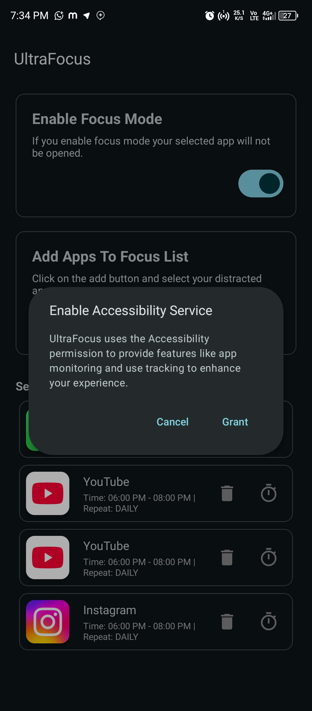

# 📱 UltraFocus

**UltraFocus** is an open-source Android app that helps you beat distractions and improve productivity by blocking selected apps for a specific time duration. Once **Focus Mode** is enabled, any app you've added to your block list will be force-closed if opened, and a focus screen will be displayed instead.

> 🧘 Stay focused. Stay productive. The digital way.

---

<div align="center"> 
         
<h4>Download</h4>

<a>[](https://github.com/binondi/Calculator-Hide-Files/releases) </a>

</div>

## ✨ Features

- ✅ Select apps to block
- ⏳ Set a custom focus duration
- 🚫 Blocks selected apps during focus time
- 🧘 Displays a full-screen focus message if blocked apps are opened
- 🔐 Prevents bypassing with an immersive experience
- 💡 Lightweight and simple UI
- 📱 Built with Kotlin and follows Android best practices

---

## 📸 Screenshots

<div align="center">
  
  
  
</div>

<div align="center">
  
  
    
</div>

<div align="center">
    
    
    
</div>

---

## 🚀 How It Works

1. Launch the app and select apps you want to block.
2. Set the focus duration (e.g., 30 minutes, 1 hour, etc.).
3. Tap **Start Focus Mode**.
4. If any blocked app is opened, UltraFocus immediately closes it and shows a custom screen.
5. Once the timer ends, access to blocked apps is restored.

---

## 🛠️ Tech Stack

- **Language:** Kotlin
- **Architecture:** MVVM
- **UI:** XML Layouts / Material Design
- **Permissions:** Accessibility for app monitoring & Blocking
- **Android SDK:** Compatible with Android 8.0+ (API 26+)

---

| Permission | Description |
|------------|-------------|
| `QUERY_ALL_PACKAGES` | Lets the app list all installed apps so users can select which ones to block. |
| `POST_NOTIFICATIONS` | Allows UltraFocus to show a persistent notification during Focus Mode. |
| `SYSTEM_ALERT_WINDOW` | Enables the display of a full-screen focus overlay on top of blocked apps. |
| `RECEIVE_BOOT_COMPLETED` | Ensures Focus Mode can restart automatically after the device is rebooted. |
| `PACKAGE_USAGE_STATS` | Required for detecting which app is currently in use and applying the block if needed. *(User must manually grant Usage Access)* |
| `REQUEST_IGNORE_BATTERY_OPTIMIZATIONS` | Prevents the app from being killed in the background by battery-saving settings. |

> ⚠️ **Privacy First:** UltraFocus does **not** collect or share any personal or app usage data. All functionality runs **locally** on the user’s device.

---

## 📦 Installation

You can clone and build the project using Android Studio:

```bash
git clone https://github.com/Binondi/UltraFocus.git
